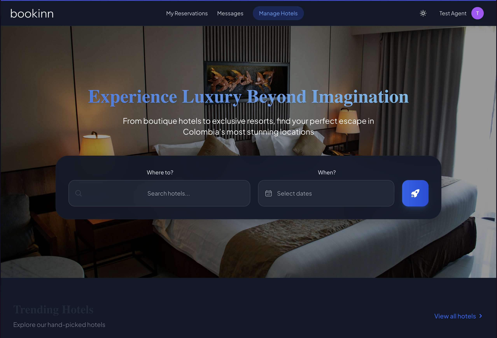
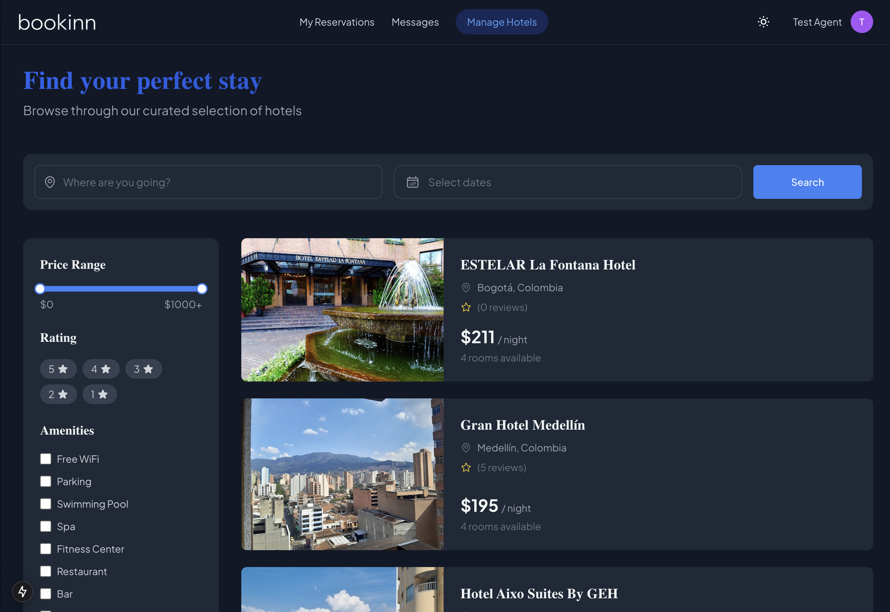
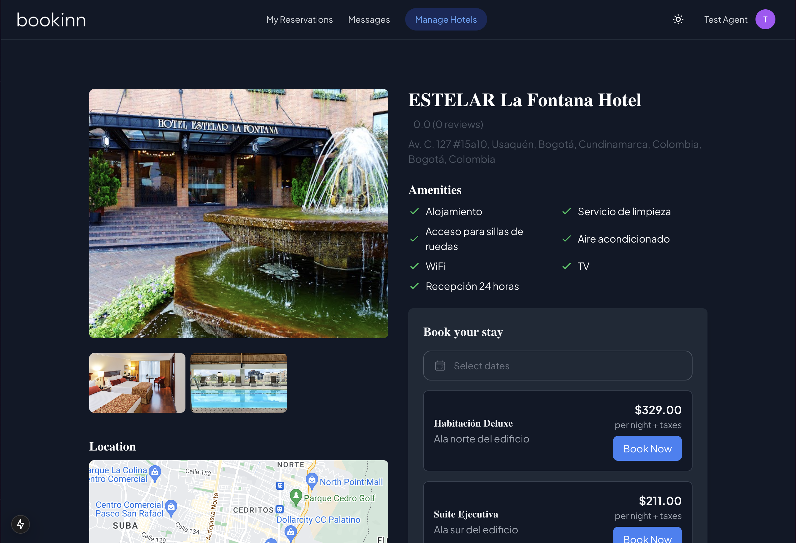
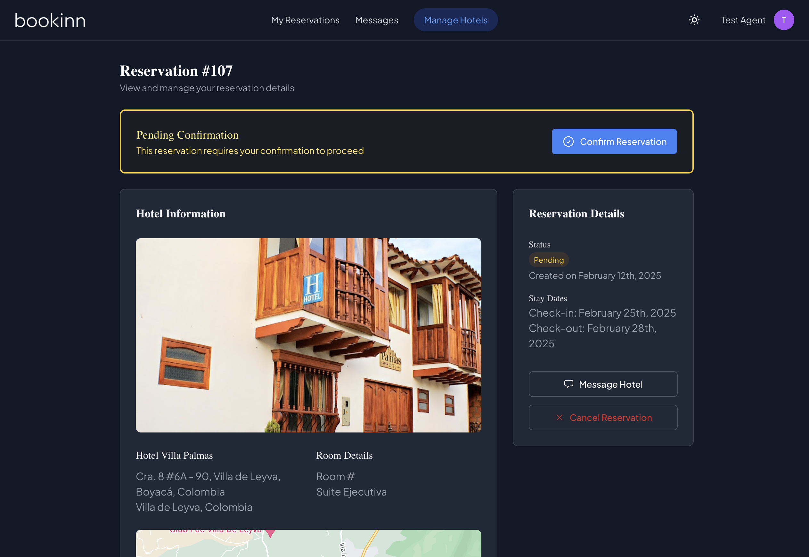
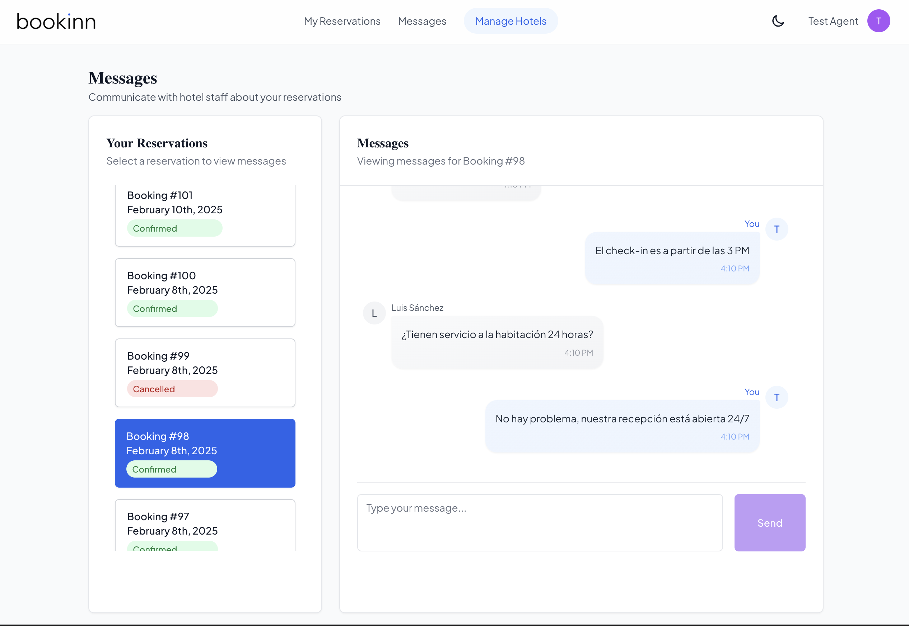
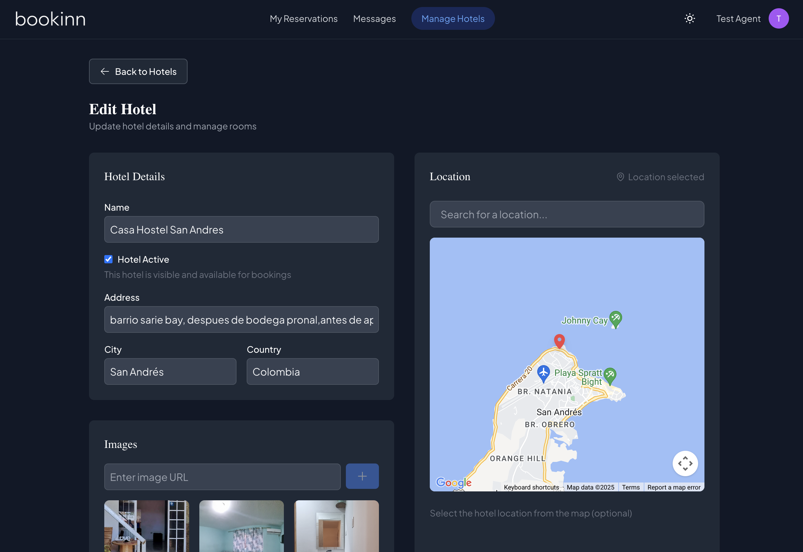
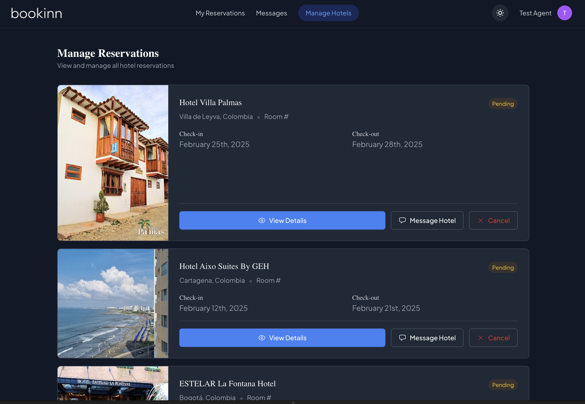
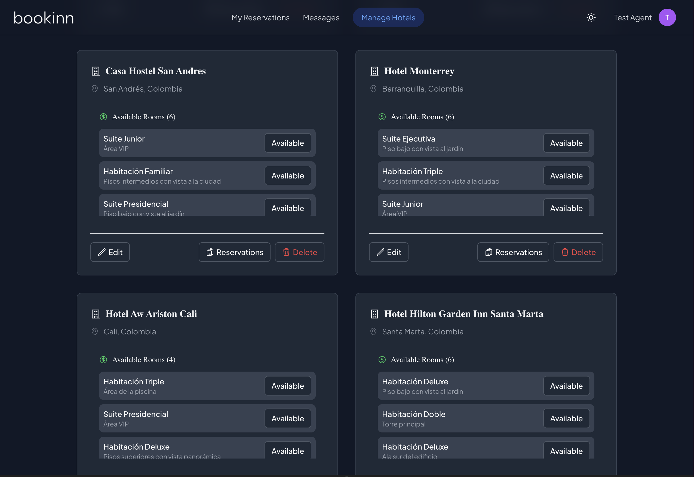

# Book Inn 🏨 

<div align="center">
  
  <p><em>Your Ultimate Hotel Booking Experience</em></p>
</div>


## ✨ Features

### For Travelers 🌍
- 🔍 Search hotels by city, dates, and price range
- 📱 Manage your reservations
- 💬 Direct messaging with hotel staff
- 📅 Real-time room availability
- ⭐ Hotel ratings and reviews

### For Hotel Managers 🏢
- 📊 Hotel and room management dashboard
- 🛏️ Room availability control
- 📨 Guest communication system
- 🏨 Multiple hotel management
- 💼 Reservation oversight

## 🚀 Tech Stack

### Frontend
- Next.js with React
- TypeScript
- Tailwind CSS
- Zustand for state management
- React Query
- Google Maps integration

### Backend
- NestJS
- TypeORM
- MySQL
- JWT Authentication
- TypeScript

______
> **DEMO**: [https://book-inn-bice.vercel.app](https://book-inn-bice.vercel.app)
______
### 👥 Available Users

You can use any of these users to test the application:

#### Agent user
- Email: agent@bookinn.com
- Password: password123
- Role: Agent

#### Traveler user
- Email: traveler@example.com
- Password: password123
- Role: Traveler

## 🛠️ Getting Started

### Prerequisites
- Node.js >= 18
- npm >= 9
- MySQL >= 8

### Installation

1. Clone the repository:
```bash
git clone https://github.com/yourusername/book-inn.git
cd book-inn
```

2. Install dependencies:
```bash
npm install
```

3. Set up environment variables:
```bash
cp .env.example .env
cp apps/web-react/.env.local.example apps/web-react/.env.local
```

4. Start the development servers:
```bash
# Start all services
npm run dev

# Start API only
npm run dev:api

# Start Web only
npm run dev:web
```

The application will be available at:
- Frontend: http://localhost:3000
- API: http://localhost:8080/api

## 🧪 Testing

```bash
# Run API tests
npm run test:api

# Run SDK tests
npm run test:api-sdk

# Watch mode
npm run test:watch

# Coverage report
npm run test:coverage
```

## 📱 Key Features in Detail

### Hotel Search and Booking
- Advanced search filters
- Availability checking
- Secure booking process
- Instant confirmation

### User Management
- JWT-based authentication
- Role-based access control
- User profiles
- Booking history

### Hotel Management
- Hotel information management
- Room inventory control
- Reservation management
- Guest communication

### UI/UX
- Responsive design
- Dark/Light mode support
- Interactive maps

## 🌐 Environment Variables

### API (.env)
```
DATABASE_HOST=localhost
DATABASE_PORT=3306
DATABASE_USERNAME=root
DATABASE_PASSWORD=root
DATABASE_NAME=book_inn
JWT_SECRET=your_jwt_secret
JWT_REFRESH_SECRET=your_refresh_secret
GOOGLE_PLACES_API_KEY=your_google_api_key
```

### Frontend (apps/web-react/.env.local)
```
NEXT_PUBLIC_API_URL=http://localhost:8080
NEXT_PUBLIC_GOOGLE_MAPS_API_KEY=your_google_api_key
```

## 📸 Screenshots

<div align="center">

###  Home Page & Search


### 📝 Hotels List


### 📝 Hotel Details


### 📝 Reservation Confirmation


### 💬 Messages (light theme)


### 📝 Edit/Create Hotel


### 📝 Manage Reservations


### 📝 Manage Hotels



</div>

## 👻 LICENCE

[WTFPL](http://www.wtfpl.net/about/)
